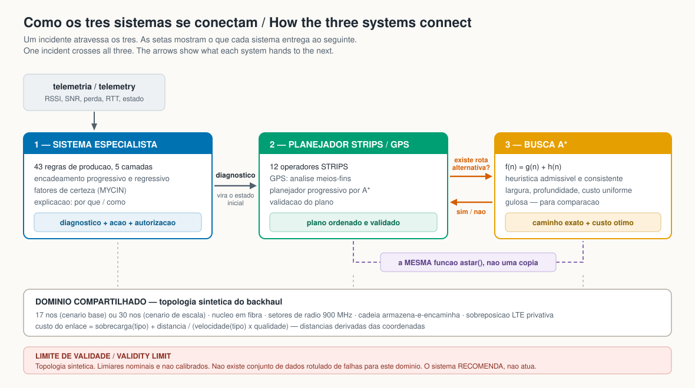

# ai-for-smartgrids

[](https://github.com/fsd-dantas/ai-for-smartgrids/actions/workflows/tests.yml)
[](LICENSE)
[](pyproject.toml)

> **PT-BR** — Tres sistemas simbolicos de Inteligencia Artificial aplicados a um mesmo dominio: redes de comunicacao para sistemas eletricos inteligentes. Um sistema especialista de diagnostico, um gerador automatico de planos de acao (STRIPS / GPS) e uma implementacao de busca A*.
>
> **EN** — Three symbolic Artificial Intelligence systems applied to a single domain: communication networks for smart electric systems. A diagnostic expert system, an automated action-plan generator (STRIPS / GPS), and an A* search implementation.

[Português](#português) · [English](#english)

---

## Os tres sistemas / The three systems

| # | Sistema / System | Tecnica / Technique | Codigo / Code |
|---|---|---|---|
| 1 | Sistema especialista / Expert system | Regras de producao, encadeamento progressivo e regressivo, fatores de certeza / Production rules, forward and backward chaining, certainty factors | [`expert_system/`](src/aisg/expert_system/) |
| 2 | Geracao de planos / Plan generation | STRIPS + GPS (analise meios-fins) + planejamento progressivo por A* / STRIPS + GPS (means-ends analysis) + A* progression planning | [`planning/`](src/aisg/planning/) |
| 3 | Busca A* / A* search | A*, custo uniforme, gulosa, largura, profundidade / A*, uniform cost, greedy, breadth-first, depth-first | [`search/`](src/aisg/search/) |

**Os tres se conectam.** O diagnostico produzido pelo sistema especialista vira o estado inicial do planejador; a acao *desviar trafego* so e aplicavel quando a busca A* confirma que existe rota alternativa; e o planejador progressivo usa **a mesma funcao A***, sem copia, que resolve o roteamento.

**The three connect.** The expert system's diagnosis becomes the planner's initial state; the *reroute traffic* action is applicable only when A* search confirms an alternative route exists; and the progression planner uses **the same A\* function**, not a copy, that solves routing.



### Diagramas / Diagrams

| Diagrama | Conteudo / Contents |
|---|---|
| [Integracao](docs/assets/01-integration.svg) | Como os tres sistemas trocam informacao / How the three systems exchange information |
| [Sistema especialista](docs/assets/02-expert-system.svg) | As cinco camadas de regras e os dois encadeamentos / The five rule layers and both chainings |
| [Planejamento](docs/assets/03-planning.svg) | Anatomia STRIPS e a recursao meios-fins do GPS / STRIPS anatomy and GPS means-ends recursion |
| [Busca A*](docs/assets/04-astar.svg) | f = g + h, a prova de admissibilidade e a comparacao / f = g + h, the admissibility proof, and the comparison |

---

## Instalacao e execucao rapida / Install and quick start

Nao ha dependencias externas no nucleo: apenas a biblioteca padrao do Python 3.10+.
The core has no third-party dependencies: only the Python 3.10+ standard library.

```bash
git clone https://github.com/fsd-dantas/ai-for-smartgrids.git
cd ai-for-smartgrids
python -m pip install -e .

# 1 — sistema especialista / expert system
aisg diagnose --case interference --trace --explain
aisg diagnose --interactive --mode backward      # consulta guiada por objetivo

# 2 — planejamento / planning
aisg plan --diagnosis node_power_failure --node RM_A5 --solver both --trace

# 3 — busca A* / A* search
aisg route --from NOC --to RECLOSER_7 --compare --expansion

# cenario de escala, 30 nos / scale scenario, 30 nodes
aisg --topology scale route --compare

# os tres em sequencia / all three in sequence
aisg pipeline --case congestion --node SAF_A2
```

Sem instalar / without installing: `PYTHONPATH=src python -m aisg ...`
Em ingles / in English: acrescente `--lang en` / add `--lang en`.

Testes / tests: `python -m pytest` (108 testes / 108 tests).

Apresentacao / presentation: [`notebooks/apresentacao.ipynb`](notebooks/apresentacao.ipynb).

---

## Português

### O dominio

O dominio e a rede de comunicacao que liga ativos distribuidos de um sistema eletrico ao centro de operacao: um nucleo em fibra, dois setores de radio em 900 MHz, uma cadeia de repetidores *armazena-e-encaminha* e uma sobreposicao de LTE privativo. Sao 17 nos e 24 enlaces.

**A topologia e SINTETICA.** E um modelo didatico da *classe* de cenarios estudada em laboratorios de pesquisa em backhaul sem fio. Nao contem inventario real, enderecamento, identificacao de equipamento, configuracao de RF nem topologia de campo de qualquer laboratorio ou concessionaria. Ver [`docs/domain-model.md`](docs/domain-model.md).

### Por que sistemas simbolicos, e nao aprendizado de maquina

Nao existe, para este dominio, conjunto de dados rotulado de falhas. Rotular um enlace como *degradado* ou *em falha* exige um instrumento de degradacao controlada e uma linha de base de observabilidade autenticada; sem os dois, nao ha rotulo derivado de medicao. Um metodo indutivo treinado apenas em estado normal nao infere degradacao de modo confiavel.

Quando nao ha dados rotulados, o caminho honesto e codificar **conhecimento de engenharia** em regras explicitas, auditaveis e questionaveis — que e exatamente o que um sistema especialista faz. O sistema declara essa limitacao na propria saida: os limiares sao **nominais e nao calibrados**, e reunidos num unico bloco (`THRESHOLDS`) para que a calibracao futura ajuste valores sem reescrever regras.

O sistema **recomenda, nao atua**. Toda acao que alcanca a planta exige autorizacao — no planejador isso nao e recomendacao, e *precondicao*: agir sem autorizacao e um estado inalcancavel.

### Documentacao

| Documento | Conteudo |
|---|---|
| [`docs/01-expert-system.md`](docs/01-expert-system.md) | Variaveis, as 43 regras, fatores de certeza, encadeamentos, resolucao de conflito, explicacao |
| [`docs/02-planning.md`](docs/02-planning.md) | STRIPS, GPS e analise meios-fins, planejador A*, limitacoes do GPS |
| [`docs/03-astar.md`](docs/03-astar.md) | A*, prova de admissibilidade e consistencia, comparacao entre estrategias |
| [`docs/domain-model.md`](docs/domain-model.md) | Topologia, modelo de custo e limites de validade |
| [`docs/presentation-script.md`](docs/presentation-script.md) | Roteiro da apresentacao — 30 minutos por tema |

---

## English

### The domain

The domain is the communication network linking distributed assets of an electric system to the operations centre: a fibre core, two 900 MHz radio sectors, a *store-and-forward* relay chain, and a private LTE overlay. It has 17 nodes and 24 links.

**The topology is SYNTHETIC.** It is a didactic model of the *class* of scenarios studied in wireless backhaul research testbeds. It contains no real inventory, addressing, equipment identification, RF configuration, or field topology of any laboratory or utility. See [`docs/domain-model.md`](docs/domain-model.md).

### Why symbolic systems rather than machine learning

No labelled fault dataset exists for this domain. Labelling a link as *degraded* or *failed* requires a controlled degradation instrument and an authenticated observability baseline; without both, no label is derived from measurement. An inductive method trained only on the normal state cannot reliably infer degradation.

When labelled data does not exist, the honest path is to encode **engineering knowledge** as explicit, auditable, contestable rules — which is exactly what an expert system does. The system declares this limitation in its own output: the thresholds are **nominal and uncalibrated**, and gathered in a single block (`THRESHOLDS`) so future calibration adjusts values without rewriting rules.

The system **recommends, it does not act**. Every action that reaches the plant requires authorisation — and in the planner that is not advice but a *precondition*: acting without authorisation is an unreachable state.

### Documentation

| Document | Contents |
|---|---|
| [`docs/01-expert-system.md`](docs/01-expert-system.md) | Variables, the 43 rules, certainty factors, both chainings, conflict resolution, explanation |
| [`docs/02-planning.md`](docs/02-planning.md) | STRIPS, GPS and means-ends analysis, the A* planner, GPS's limitations |
| [`docs/03-astar.md`](docs/03-astar.md) | A*, admissibility and consistency proofs, strategy comparison |
| [`docs/domain-model.md`](docs/domain-model.md) | Topology, cost model, and validity limits |
| [`docs/presentation-script.md`](docs/presentation-script.md) | Presentation script — 30 minutes per topic |

---

## Estrutura / Layout

```
src/aisg/
  domain/          modelo compartilhado: topologia e custo / shared model: topology and cost
  expert_system/   motor de inferencia + base de conhecimento / inference engine + knowledge base
  planning/        STRIPS, GPS, planejador A* / STRIPS, GPS, A* planner
  search/          A* e as demais estrategias / A* and the other strategies
  cli.py           interface de linha de comando / command-line interface
tests/             99 testes / 99 tests
docs/              documentacao bilingue / bilingual documentation
notebooks/         roteiro executavel da apresentacao / executable presentation script
```

## Referencias / References

- FIKES, R. E.; NILSSON, N. J. STRIPS: a new approach to the application of theorem proving to problem solving. *Artificial Intelligence*, v. 2, n. 3-4, p. 189-208, 1971.
- NEWELL, A.; SIMON, H. A. *GPS, a program that simulates human thought*. Santa Monica: RAND Corporation, 1961.
- HART, P. E.; NILSSON, N. J.; RAPHAEL, B. A formal basis for the heuristic determination of minimum cost paths. *IEEE Transactions on Systems Science and Cybernetics*, v. 4, n. 2, p. 100-107, 1968.
- SHORTLIFFE, E. H.; BUCHANAN, B. G. A model of inexact reasoning in medicine. *Mathematical Biosciences*, v. 23, n. 3-4, p. 351-379, 1975.
- TURING, A. M. Computing machinery and intelligence. *Mind*, v. LIX, n. 236, p. 433-460, 1950.
- RUSSELL, S.; NORVIG, P. *Artificial intelligence*: a modern approach. 4. ed. Harlow: Pearson, 2021.

## Como citar / How to cite

Use [`CITATION.cff`](CITATION.cff). No GitHub, o botao **Cite this repository** gera BibTeX e APA a partir dele.
Use [`CITATION.cff`](CITATION.cff). On GitHub, the **Cite this repository** button generates BibTeX and APA from it.

## Autor / Author

Fernando Sabino Dantas — trabalhos praticos da disciplina de Introducao a Inteligencia Artificial (mestrado/doutorado).
Practical assignments for the Introduction to Artificial Intelligence course (MSc/PhD).

## Licenca / License

[MIT](LICENSE).
