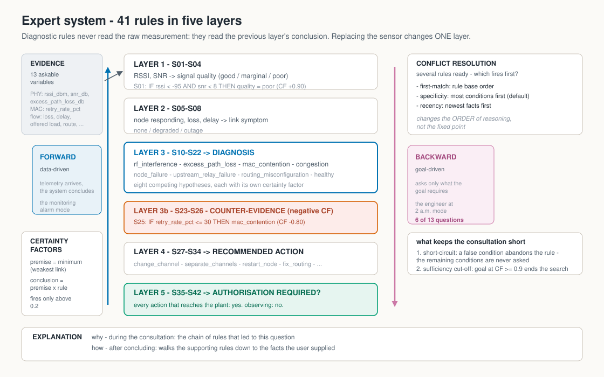

# 1 — Sistema especialista / Expert system

> Diagnostico de enlace de backhaul degradado, com regras de producao, encadeamento
> progressivo e regressivo, fatores de certeza e explicacao.
>
> Link-degradation diagnosis with production rules, forward and backward chaining,
> certainty factors, and explanation.

Codigo / code: [`src/aisg/expert_system/`](../src/aisg/expert_system/)

<p align="center">
  <picture>
    <source media="(prefers-color-scheme: dark)" srcset="assets/02-expert-system-dark.svg">
    
  </picture>
</p>

---

## Português

### Problema

Um enlace do backhaul degradou ou caiu. **Por que?** E **o que fazer?**

O sistema classifica a causa entre oito hipoteses e recomenda uma acao, declarando quanta certeza tem em cada conclusao.

### Por que um sistema especialista, e nao inducao

Nao existe conjunto de dados rotulado de falhas para este dominio. Para rotular um enlace como *degradado* ou *em falha* seria preciso um instrumento de degradacao controlada e uma linha de base de observabilidade autenticada. Sem os dois, o rotulo nao vem da medicao — e um metodo indutivo treinado apenas em estado normal nao infere degradacao de modo confiavel.

Onde nao ha dados rotulados, resta codificar conhecimento de engenharia em regras explicitas. A vantagem nao e apenas de disponibilidade: a regra e **auditavel e contestavel**. Um especialista pode discordar da regra R14 e mudar so ela. Nao se discute assim com um peso de rede neural.

Essa e a razao pratica do contraste entre metodos **dedutivos** (regras dadas por especialistas) e **indutivos** (padroes extraidos de exemplos).

### Variaveis

**Evidencia observavel (13, perguntaveis):**

| Variavel | Tipo | Dominio |
|---|---|---|
| `rssi_dbm` | numerica | [-120, -30] dBm |
| `snr_db` | numerica | [-5, 40] dB |
| `packet_loss_pct` | numerica | [0, 100] % |
| `rtt_ms` | numerica | [0, 5000] ms |
| `traffic_load_pct` | numerica | [0, 100] % |
| `link_state` | categorica | up, down, flapping |
| `node_power` | categorica | ok, on-battery, failed |
| `weather` | categorica | clear, rain, storm |
| `spectrum_scan` | categorica | clean, occupied |
| `neighbours_affected` | categorica | none, one, many |
| `recent_change` | categorica | none, config, firmware, antenna |
| `vlan_trunk_ok` | booleana | yes, no |
| `upstream_relay_reachable` | booleana | yes, no |

**Conclusoes intermediarias (2):** `signal_quality` (good, marginal, poor) e `link_symptom` (none, degraded, unstable, outage).

**Objetivos (3):** `diagnosis`, `recommended_action`, `authorization_required`.

### As 43 regras, em cinco camadas

| Camada | Regras | Papel |
|---|---|---|
| 1 | R01–R04 | Medicoes de RF → `signal_quality` |
| 2 | R05–R09 | Estado e desempenho → `link_symptom` |
| 3 | R10–R24 | Evidencia → `diagnosis` (oito hipoteses) |
| 3b | R25–R27 | **Contra-evidencia**: CF negativo contra hipoteses |
| 4 | R28–R35 | `diagnosis` → `recommended_action` |
| 5 | R36–R43 | `recommended_action` → `authorization_required` |

A estratificacao importa: as regras da camada 3 nunca olham `rssi_dbm` diretamente, apenas `signal_quality`. Trocar o sensor de RF muda a camada 1 e nada mais.

**Um exemplo de cada tipo:**

```
R10:  SE qualidade do sinal = poor E varredura = occupied
      ENTAO diagnostico = rf_interference          (CF +0,85)

R25:  SE clima = clear
      ENTAO diagnostico = rain_fade                (CF -0,80)   <- contra-evidencia

R36:  SE acao recomendada = change_channel
      ENTAO exige autorizacao = yes                (CF +1,00)
```

### Fatores de certeza

Um fator de certeza (CF) esta em [-1, +1]: +1 confirmado, -1 refutado, 0 sem evidencia. Seguindo o MYCIN (Shortliffe e Buchanan, 1975):

- o CF de uma premissa e o **minimo** entre suas condicoes — o elo mais fraco;
- a regra contribui `CF_premissa x CF_regra`;
- a regra so dispara se a premissa passar do limiar 0,2, para que evidencia fraca nao se propague;
- duas conclusoes independentes sobre o mesmo fato combinam-se por:

```
ambos >= 0:   cf1 + cf2 * (1 - cf1)
ambos <= 0:   cf1 + cf2 * (1 + cf1)
sinais opostos: (cf1 + cf2) / (1 - min(|cf1|, |cf2|))
```

Evidencias que se reforcam aproximam-se de 1 sem nunca alcancar; evidencias contraditorias se cancelam. Duas evidencias de 0,8 dao 0,96 — mais forte que qualquer uma, ainda longe da certeza.

**Por que isso e necessario aqui:** `weather = storm` aumenta a suspeita de atenuacao por chuva sem prova-la. Regras booleanas obrigariam a escolher entre ignorar a evidencia e afirmar demais.

### Encadeamento progressivo e regressivo

**Progressivo (dirigido por dados).** Parte dos fatos e deriva tudo o que puder. E o modo *alarme de monitoramento*: chega telemetria, o sistema conclui.

O ciclo e reconhecer-agir: monta o conjunto de conflito, resolve o conflito e dispara **uma** regra por ciclo. Uma por ciclo, e nao todas, para que a ordem do raciocinio fique visivel no trace — e para que a resolucao de conflito tenha efeito observavel.

**Regressivo (dirigido por objetivo).** Parte da pergunta "o diagnostico e X?" e busca so a evidencia que a sustenta. E o modo *engenheiro as 2 da manha*: e o modo do Expert SINTA.

Duas propriedades tornam a consulta curta:

1. **Curto-circuito.** Assim que uma condicao e falsa, a regra e abandonada e as condicoes restantes **nao sao perguntadas**.
2. **Corte por suficiencia.** Quando o objetivo atinge CF >= 0,9, o motor para de procurar mais apoio.

Na pratica, o caso `power_failure` conclui perguntando 6 das 13 variaveis. O progressivo, com os mesmos fatos, chega a mesma conclusao — como verifica o teste `test_backward_chaining_matches_forward_chaining_on_the_same_evidence`.

### Resolucao de conflito

Quando varias regras estao prontas, qual dispara primeiro?

| Politica | Criterio |
|---|---|
| `first-match` | Ordem da base de regras |
| `specificity` | Regra mais especifica primeiro (mais condicoes) — **padrao** |
| `recency` | Regra que usa os fatos mais recentes |

Com regras monotonicas, a politica muda **a ordem do raciocinio, nao o ponto fixo**: os testes verificam as duas coisas — que a ordem de disparo difere entre politicas e que o diagnostico final e o mesmo.

### Explicacao

**`por que`** (durante a consulta): mostra a cadeia de regras que levou ate a pergunta. Digite `?` no modo interativo.

**`como`** (apos a conclusao): percorre recursivamente as regras que sustentam o fato ate chegar aos fatos informados pelo usuario.

```
diagnostico = node_power_failure (CF +0,95, R16)
  <= R16: SE alimentacao do no = failed ENTAO diagnostico = node_power_failure (CF +0,95)
     Falha de alimentacao explica a perda do no independentemente do radio.
      alimentacao do no = failed (CF +1,00, fato inicial)
```

### Calibracao

Todos os limiares numericos vivem em `THRESHOLDS`, em [`kb_backhaul.py`](../src/aisg/expert_system/kb_backhaul.py). Sao **nominais e nao calibrados**. Quando existir linha de base medida, ajustam-se os valores; as regras nao mudam. E por isso que o bloco esta declarado num unico lugar.

### Como executar

```bash
aisg diagnose --case interference --trace --explain
aisg diagnose --case congestion --strategy recency --trace
aisg diagnose --interactive --mode backward --goal diagnosis
```

No modo interativo, uma certeza opcional pode acompanhar a resposta: `rain 0.6`.

---

## English

### Problem

A backhaul link degraded or failed. **Why?** And **what should be done?** The system classifies the cause among eight hypotheses and recommends an action, stating how certain it is.

### Why an expert system rather than induction

No labelled fault dataset exists for this domain. Labelling a link *degraded* or *failed* would require a controlled degradation instrument and an authenticated observability baseline. Without both, the label does not come from measurement — and an inductive method trained only on the normal state cannot reliably infer degradation.

Where labelled data is absent, what remains is encoding engineering knowledge as explicit rules. The advantage is not only availability: a rule is **auditable and contestable**. An expert can disagree with rule R14 and change that rule alone. You cannot argue that way with a neural network weight.

That is the practical reason behind the contrast between **deductive** methods (rules given by experts) and **inductive** ones (patterns extracted from examples).

### Variables

Thirteen askable observations (RF measurements, link state, power, weather, spectrum scan, affected neighbours, recent change, VLAN trunk, upstream relay), two intermediate conclusions (`signal_quality`, `link_symptom`), and three goals (`diagnosis`, `recommended_action`, `authorization_required`). Full domains in the Portuguese table above.

### The 43 rules, in five layers

Layer 1 (R01–R04) maps RF measurements to `signal_quality`; layer 2 (R05–R09) maps state and performance to `link_symptom`; layer 3 (R10–R24) maps evidence to `diagnosis`; R25–R27 supply **counter-evidence** with negative CFs; layer 4 (R28–R35) maps diagnosis to action; layer 5 (R36–R43) decides whether authorisation is required.

Stratification matters: layer-3 rules never read `rssi_dbm` directly, only `signal_quality`. Replacing the RF sensor changes layer 1 and nothing else.

### Certainty factors

A CF lies in [-1, +1]. Following MYCIN: a premise's CF is the **minimum** across its conditions; a rule contributes `premise_cf x rule_cf`; a rule fires only above the 0.2 threshold; and independent conclusions combine with the MYCIN combination function. Reinforcing evidence approaches 1 without reaching it — two 0.8 observations give 0.96.

This is necessary here because `weather = storm` raises suspicion of rain fade without proving it. Boolean rules would force a choice between ignoring the evidence and overclaiming.

### Forward and backward chaining

**Forward** (data-driven) starts from facts and derives everything it can — the *monitoring alarm* mode. The recognise-act cycle fires **one** rule per cycle so the reasoning order is visible in the trace and conflict resolution has an observable effect.

**Backward** (goal-driven) starts from "is the diagnosis X?" and seeks only the evidence that supports it — the *engineer at 2 a.m.* mode, and Expert SINTA's mode. Two properties keep the consultation short: **short-circuiting** (once a condition is false, the rule is abandoned and the remaining conditions are never asked) and a **sufficiency cut-off** (once the goal reaches CF >= 0.9, the engine stops seeking further support). The `power_failure` case concludes after asking 6 of 13 variables.

### Conflict resolution

`first-match` (base order), `specificity` (most conditions first, the default), and `recency` (newest facts first). With monotonic rules, the policy changes **the order of reasoning, not the fixed point** — the tests verify both halves of that claim.

### Explanation

**`why`** during the consultation shows the rule chain that led to the question (type `?`). **`how`** after the conclusion walks the supporting rules recursively down to user-supplied facts.

### Calibration

Every numeric threshold lives in `THRESHOLDS`. They are **nominal and uncalibrated**. When a measured baseline exists, the values are re-fitted and the rules stay as they are.
