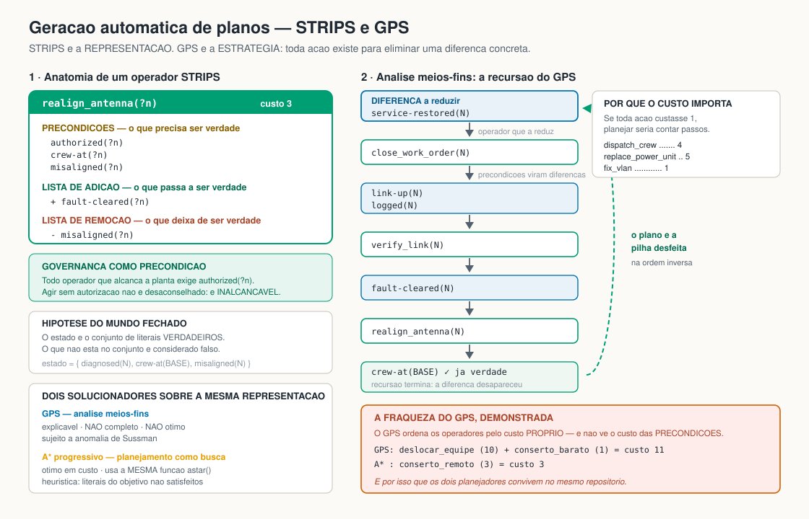

# 2 — Geracao automatica de planos / Automated plan generation

> Representacao STRIPS, solucionador GPS por analise meios-fins e planejador
> progressivo por A*.
>
> STRIPS representation, GPS means-ends solver, and A* progression planner.

Codigo / code: [`src/aisg/planning/`](../src/aisg/planning/)



---

## Português

### Problema

O sistema especialista diagnosticou uma falha e recomendou uma acao. **Em que sequencia executa-la?** Uma equipe nao pode realinhar uma antena antes de chegar ao local, e nada pode tocar a planta antes da autorizacao.

Objetivo: `service-restored(N)` e `logged(N)`.

### STRIPS: a representacao

STRIPS (Fikes e Nilsson, 1971) representa uma acao por tres conjuntos:

- **precondicoes** — o que precisa ser verdade para aplicar;
- **lista de adicao** — o que passa a ser verdade;
- **lista de remocao** — o que deixa de ser verdade.

O estado do mundo e o conjunto de literais positivos verdadeiros. O que nao esta no conjunto e falso: **hipotese do mundo fechado**.

```
change_channel(?n)
  precondicoes:  authorized(?n), interference(?n)
  adiciona:      fault-cleared(?n)
  remove:        interference(?n)
  custo:         2
```

### Os doze operadores

| Operador | Custo | Exige equipe no local? | Exige autorizacao? |
|---|---|---|---|
| `request_authorization(?n)` | 1 | nao | — |
| `dispatch_crew(?from, ?to)` | 4 | — | sim |
| `change_channel(?n)` | 2 | nao | sim |
| `realign_antenna(?n)` | 3 | **sim** | sim |
| `replace_power_unit(?n)` | 5 | **sim** | sim |
| `restore_relay(?n)` | 2 | nao | sim |
| `fix_vlan(?n)` | 1 | nao | sim |
| `reroute_traffic(?n)` | 2 | nao | sim + rota alternativa |
| `monitor_and_wait(?n)` | 1 | nao | **nao** |
| `verify_link(?n)` | 1 | nao | — |
| `record_logbook(?n)` | 1 | nao | — |
| `close_work_order(?n)` | 1 | nao | — |

### Governanca como precondicao, nao como recomendacao

Todo operador que alcanca a planta exige `authorized(?n)`. Isso nao e enfeite: torna "agimos sem autorizacao" um estado **inalcancavel**, e nao apenas desaconselhado. Um teste verifica a invariante em todos os diagnosticos.

A unica excecao e `monitor_and_wait`, porque observar nao altera a planta. O contraste e deliberado: no caso de atenuacao por chuva, o plano correto **nao toca a planta** e nem desloca equipe — a causa e transitoria, e intervir seria tratar o clima.

### O custo de `dispatch_crew` faz o planejamento importar

Se todas as acoes custassem 1, planejar seria contar passos. Com `dispatch_crew` a 4 e `replace_power_unit` a 5, o planejador precisa realmente pesar: uma correcao remota barata pode vencer uma correcao local aparentemente mais simples.

### GPS: analise meios-fins

O GPS de Newell e Simon (1959, 1961) planeja por **analise meios-fins**:

1. olhe a **diferenca** entre o estado atual e o objetivo;
2. escolha um operador que **reduza** essa diferenca (a lista de adicao contem o objetivo);
3. **recursivamente**, satisfaca as precondicoes desse operador;
4. aplique o operador.

O 'porque' de cada acao e explicito: toda acao existe para eliminar uma diferenca concreta. E por isso que o trace do GPS se le como uma justificativa, nao como um log de busca:

```
DIFERENCA a reduzir: service-restored(RM_A5)
  operador candidato: close_work_order(RM_A5)
  precondicoes: link-up(RM_A5), logged(RM_A5)
    DIFERENCA a reduzir: link-up(RM_A5)
      ...
```

### Limitacoes do GPS, ditas com todas as letras

**O GPS nao e completo nem otimo.** Ele adota o primeiro operador que reduz a diferenca e so revisa por retrocesso em caso de falha.

Ele tambem sofre da **anomalia de Sussman**: com subobjetivos que interagem, atingi-los um a um pode desfazer trabalho ja feito. Nossa implementacao adota a defesa minima: apos satisfazer todos os subobjetivos, reverifica se algum foi desfeito e, se foi, **falha explicitamente** em vez de devolver um plano invalido.

**Um caso concreto de nao-otimalidade**, verificado no teste `test_gps_can_be_suboptimal_when_a_cheap_action_has_expensive_preconditions`: o GPS ordena os operadores relevantes pelo custo **proprio**, sem olhar o custo das **precondicoes**. Se a acao barata (custo 1) exigir um deslocamento caro (custo 10) e existir uma correcao remota de custo 3, o GPS escolhe o plano de custo 11; o A* encontra o de custo 3.

E exatamente por isso que os dois planejadores convivem neste repositorio.

### Planejador progressivo por A*

O planejamento vira busca:

| Busca | Planejamento |
|---|---|
| estado | conjunto de literais verdadeiros |
| sucessor | qualquer acao aplicavel |
| custo do passo | custo da acao |
| teste de objetivo | o objetivo esta contido no estado |

Com isso, **a mesma funcao `astar`** do terceiro trabalho resolve o planejamento. Nao e uma copia adaptada: e a mesma funcao, importada de [`aisg.search.algorithms`](../src/aisg/search/algorithms.py).

**Heuristica `goal_count`:** h(s) = numero de literais do objetivo ainda nao satisfeitos.

Ela e admissivel **apenas se** nenhuma acao satisfizer mais de um literal do objetivo e toda acao custar ao menos 1. Neste dominio a condicao vale: `service-restored` e `logged` sao adicionados por operadores diferentes, cada um de custo unitario. Declaramos a condicao em vez de supo-la — uma heuristica inadmissivel custaria a otimalidade em silencio.

A heuristica `zero` reduz o A* a busca de custo uniforme e serve de condicao de controle para medir quanto a heuristica de fato economiza.

### Validacao de plano

Um plano so vale se for **executavel passo a passo** e **atingir o objetivo**. O metodo `Plan.validate()` reexecuta o plano desde o estado inicial e aponta o primeiro passo inaplicavel, com a precondicao que faltou. Dois testes corrompem planos de proposito — removendo a autorizacao e removendo o fechamento — para confirmar que a validacao pega os dois defeitos.

### Integracao com a busca A*

`reroute_traffic` exige `alternate-route(?n)`. Esse literal **nao e inventado**: quando o diagnostico e congestionamento, [`problem_from_diagnosis`](../src/aisg/planning/domain_restoration.py) consulta o A* sobre a topologia, evitando o no afetado. Se nao houver rota, o literal nao entra no estado inicial, a acao fica inaplicavel e o planejador **falha honestamente** em vez de propor um desvio impossivel — comportamento verificado em teste.

### Como executar

```bash
aisg plan --diagnosis node_power_failure --node RM_A5 --solver both --trace
aisg plan --diagnosis congestion --node SAF_A2 --solver astar --heuristic zero
```

---

## English

### Problem

The expert system diagnosed a fault and recommended an action. **In what sequence should it be carried out?** A crew cannot realign an antenna before reaching the site, and nothing may touch the plant before authorisation. Goal: `service-restored(N)` and `logged(N)`.

### STRIPS: the representation

STRIPS (Fikes and Nilsson, 1971) represents an action by **preconditions**, an **add list**, and a **delete list**. A world state is the set of true positive literals; anything absent is false (closed-world assumption). Twelve operators are defined — see the table above for costs and requirements.

### Governance as a precondition, not as advice

Every operator reaching the plant requires `authorized(?n)`, which makes "we acted without authorisation" an **unreachable** state rather than a discouraged one. A test checks the invariant across every diagnosis. The single exception is `monitor_and_wait`, because observing changes nothing — and in the rain-fade case the correct plan touches neither the plant nor the crew roster, since the cause is transient.

### GPS: means-ends analysis

Newell and Simon's GPS plans by **means-ends analysis**: look at the **difference** between the current state and the goal, pick an operator that **reduces** it, recursively satisfy that operator's preconditions, then apply it. Every action exists to remove a concrete difference, which is why the GPS trace reads as a justification rather than a search log.

### GPS's limitations, stated plainly

**GPS is neither complete nor optimal.** It commits to the first operator that reduces the difference and revises only by backtracking on failure. It is also subject to the **Sussman anomaly**: with interacting subgoals, achieving them one at a time can undo earlier work. Our implementation takes the minimal defence — after satisfying all subgoals it re-checks whether any was clobbered and **fails explicitly** rather than returning an invalid plan.

A concrete non-optimality, verified in `test_gps_can_be_suboptimal_when_a_cheap_action_has_expensive_preconditions`: GPS orders relevant operators by their **own** cost, ignoring the cost of their **preconditions**. If the cheap action (cost 1) needs an expensive trip (cost 10) while a remote fix costs 3, GPS returns the cost-11 plan and A* finds the cost-3 one. That is precisely why both planners live side by side here.

### A* progression planner

Planning becomes search: a state is the set of true literals, a successor is any applicable action, the step cost is the action's cost, and the goal test is goal inclusion. **The same `astar` function** from the third assignment therefore solves planning — the same function, imported, not an adapted copy.

The `goal_count` heuristic counts unsatisfied goal literals. It is admissible **only if** no action satisfies more than one goal literal and every action costs at least 1; in this domain that holds, and we state the condition rather than assume it. The `zero` heuristic reduces A* to uniform-cost search as a control condition.

### Plan validation

A plan is valid only if it is **executable step by step** and **reaches the goal**. `Plan.validate()` re-executes it from the initial state and reports the first inapplicable step with the missing precondition. Two tests deliberately corrupt plans to confirm both failure modes are caught.

### Integration with A* search

`reroute_traffic` requires `alternate-route(?n)`, and that literal is **not invented**: for a congestion diagnosis, `problem_from_diagnosis` consults A* over the topology avoiding the affected node. With no route, the literal is absent, the action is inapplicable, and the planner **fails honestly** instead of proposing an impossible detour.
